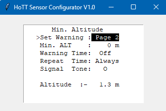
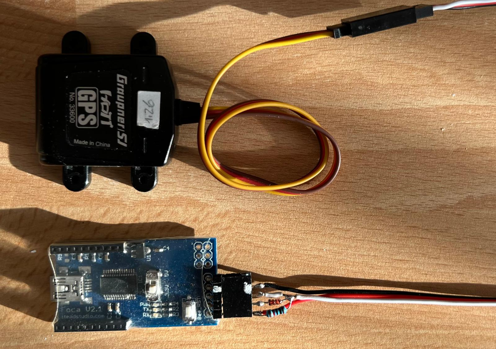

# HoTTConfig
A Windows PC tool to configure Graupner HoTT telemetry devices

## Required hardware

### USB Interface

Graupner USB interface 7168.6 with USB adapter cable 7168.S

### DIY USB Interface

Any 3.3V FTDI should work. To build the adapter cable a Schottky diode, e.g. BAT43 and a 10kOhm resistor are required.

## Install

Extract .zip to any folder, e.g. Desktop

## How to use

Connect the USB interface to the PC and take note of the Com port it got assigned (e.g. using the Windows device manager) and connect the HoTT telemetry sensor to configure. Double click on HoTTconfig.cmd and enter the Com port and type of the connected HoTT telemetry device (GAM, EAM, ESC, VARIO or GPS)

Navigate the sensor's menu with the keyboard arrow keys and use the Return key as SET key. 

